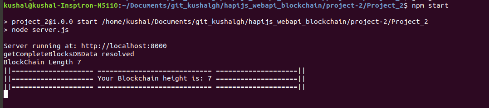
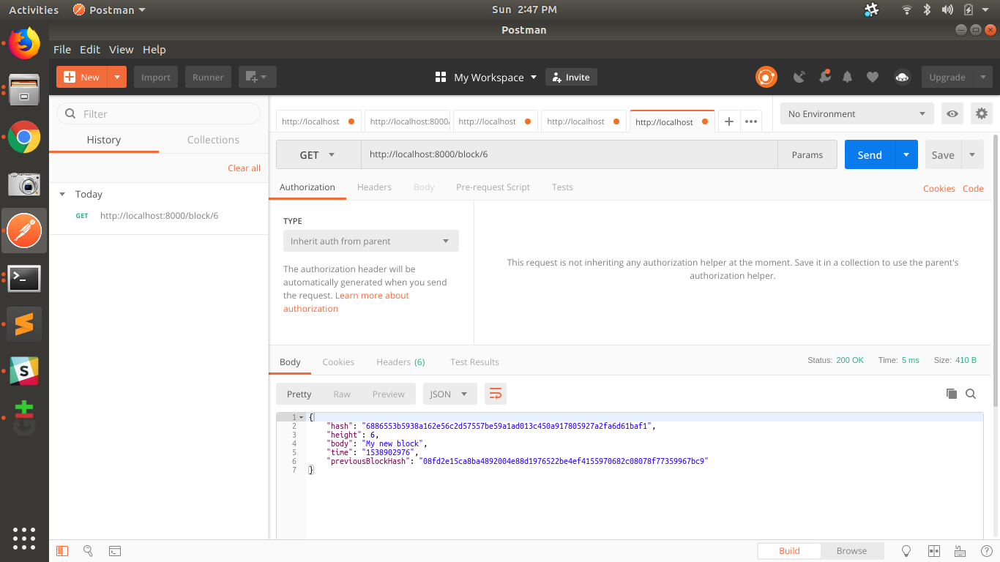
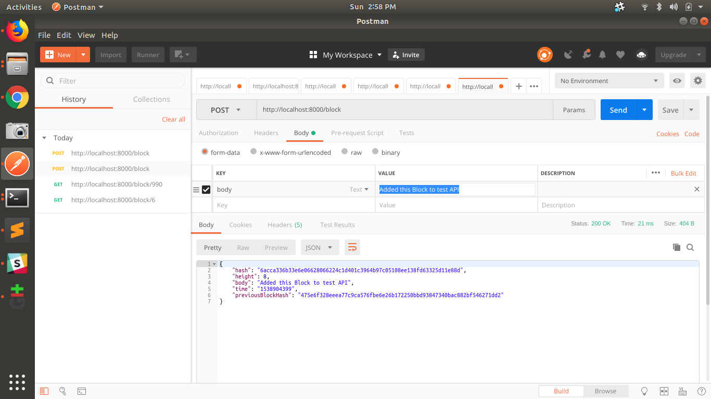
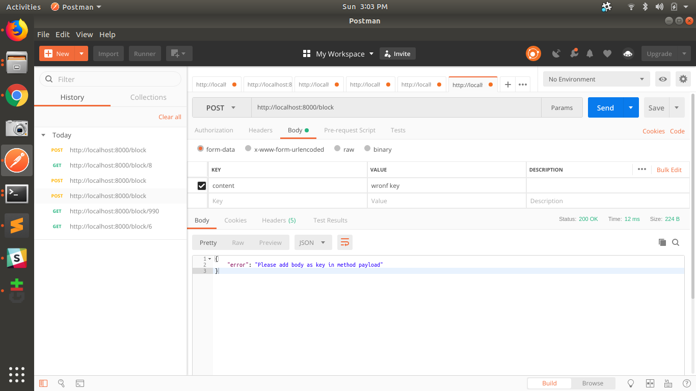

# RESTful Web API [HapiJS] with Node.js Framework

- This project introduces you to the fundamentals of web APIs with Node.js frameworks. Using your own private blockchain to create a web API is a huge first step toward developing your own web applications that are consumable by a variety of web clients. 


- For this project, we’ll build a RESTful API using a Node.js framework that will interface with the [private blockchain!](https://github.com/KushalGH/private_blockchain_leveldb). 


### STEP 1:  SELECT Node.JS framework
- Selected HapiJs.

> Reason I have selected HapiJS is:
> A rich framework for building applications and services.
> hapi enables developers to focus on writing reusable application logic instead of spending time building infrastructure.

 [FYI: Created basic hello world using ExpressJS, SailsJS and HapiJs [Link](https://github.com/KushalGH/webservices_nodeJS)]


### Step 2: PREREQUISITE: Configure Private Blockchain project here:

- Go to Private Blockchain project [Link](https://github.com/KushalGH/webservices_nodeJS)

- Fork the project [Private Blockchain project] or Copy and paste the "project-2" folder of private Blockchain project at your directory.

- Try running the Private Blockchain project. It should run. [ For details about running private blockchain project, please refer the readme.md of that project ].  Go to console - 
```
$ node
```

- Copy paste the levelsandbox.js, block.js and simpleChain.js

- Just run the Blockchain. It will either return you genesis block or just u can try any method.
```
let blockchain = new Blockchain();
```

### Step 3: If PREREQUISITES are met.

```
$ npm install hapi --save

// create server.js and paste the code
$ touch server.js

$ npm start
```	

- Your URL will be up and running: http://localhost:8000/block

> FYI When you did npm start. It should show this: 


# API END POINTS

### GET Block Endpoint
- Test tool: FIddler
- URL: http://localhost:8000/block/{height}
- End Point: GET Block Endpoint
- Method: GET

### POST Block Endpoint
- Test tool: FIddler
- URL: http://localhost:8000/block
- End Point: POST Block Endpoint
- Method: POST
- FORM DATA: 
		KEY  : body
	 	VALUE: {body of the blockchain}


# TESTING THE APPLICATION: 


### TEST CASE 1: TAKE BLOCK DETAILS OF EXISTING BLOCK

###### INPUT
- Test tool: FIddler
- URL: http://localhost:8000/block/6
- End Point: GET Block Endpoint
- Method: GET

###### OUTPUT
- JSON response
```
{
    "hash": "6886553b5938a162e56c2d57557be59a1ad013c450a917805927a2fa6d61baf1",
    "height": 6,
    "body": "My new block",
    "time": "1538902976",
    "previousBlockHash": "08fd2e15ca8ba4892004e88d1976522be4ef4155970682c08078f77359967bc9"
}
```



### TEST CASE 2: TAKE BLOCK DETAILS OF A BLOCK THAT DON"T EXIST

###### INPUT
- Test tool: FIddler
- URL: http://localhost:8000/block/990
- End Point: GET Block Endpoint
- Method: GET

###### OUTPUT
- JSON response
```
{
    "error": "Error. Block doesnot exist."
}
```


### TEST CASE 3: Add NEW BLOCK 

###### INPUT
- Test tool: FIddler
- URL: http://localhost:8000/block
- End Point: POST Block Endpoint
- Method: POST
- FORM DATA: 
		KEY  : body
	 	VALUE: Added this Block to test API
  

###### OUTPUT
- JSON response
```
{
    "hash": "6acca336b33e6e06628066224c1d401c3964b97c05108ee138fd63325d11e88d",
    "height": 8,
    "body": "Added this Block to test API",
    "time": "1538904399",
    "previousBlockHash": "475e6f328eeea77c9ca576fbe6e26b172250bbd93847340bac882bf546271dd2"
}
```


### TEST CASE 4: GET THE BLOCK CREATED IN TESTCASE 3

###### INPUT
- Test tool: FIddler
- URL: http://localhost:8000/block/8
- End Point: GET Block Endpoint
- Method: GET

###### OUTPUT
- JSON response
```
{
    "hash": "6acca336b33e6e06628066224c1d401c3964b97c05108ee138fd63325d11e88d",
    "height": 8,
    "body": "Added this Block to test API",
    "time": "1538904399",
    "previousBlockHash": "475e6f328eeea77c9ca576fbe6e26b172250bbd93847340bac882bf546271dd2"
}
```


### TEST CASE 5: Block Contents Validation

###### INPUT
- Test tool: FIddler
- URL: http://localhost:8000/block
- End Point: POST Block Endpoint
- Method: POST
- FORM DATA: 
		KEY  : content
	 	VALUE: wronf key
  

###### OUTPUT
- JSON response
```
{
    "error": "Please add body as key in method payload"
}
```

